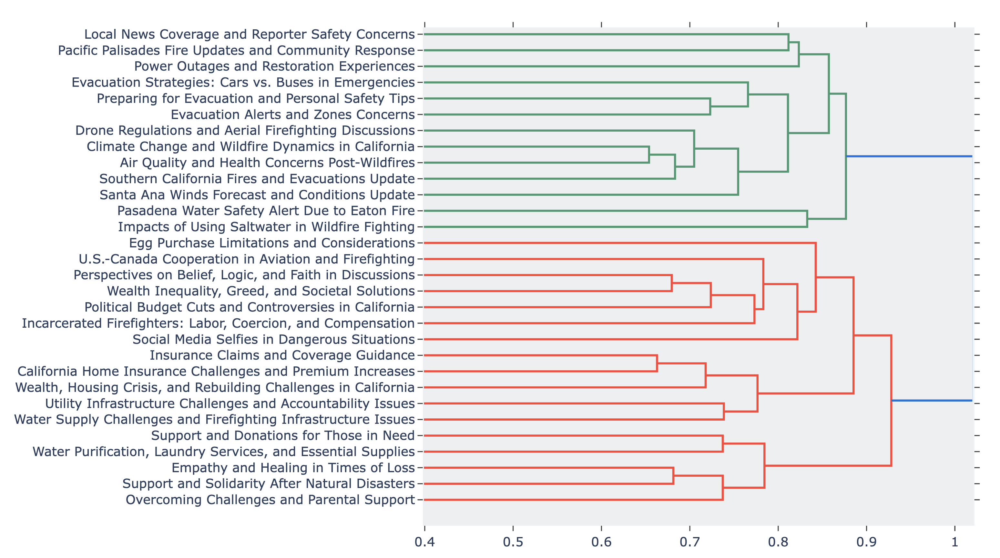

# Latent Health and Emotional Distress Topics in Reddit Discourse During the 2025 Southern California Wildfires

## Overview

This repository provides a proposed topic modeling methodology on an open-access dataset of Reddit posts and comments collected during the **January 2025 Southern California wildfires**, with a focus on **health concerns and emotional distress**.  

The open-access dataset can be found in Huggingface at https://huggingface.co/datasets/Dragmoon/2025CalifoniaWildfire. This is designed to support research in environmental health, disaster informatics, social sensing, and exposure science. 

The data were collected and curated as part of an academic study analyzing online discourse during extreme wildfire events. 

---

## Dataset ([Dragmoon/2025CalifoniaWildfire](https://huggingface.co/datasets/Dragmoon/2025CalifoniaWildfire))

The dataset repository, hosted on hugging face, includes the following components:

### 1. Reddit Posts (Raw and Clean)
- **Number of posts**: [385]

### 2. Reddit Comments (Raw and Clean)
- **Number of comments**: [114,879]

### 3. Annotations
- Annotated by guided BERTopic modeling (semi-supervised), not precise to each post and comment.
- Labels are organized under:
  - **Situational Awareness (SA)** categories (e.g., public health and safety)
  - **Crisis Narrative (CN)** categories (e.g., hero, victim)
- Additional binary flags indicate whether discourse contains:
  - Expressions of **grief**
  - Indicators of **potential mental health risk**
---

## Latent Topics




---

## Temporal and Spatial Coverage

- **Temporal range**: Jan 1– Feb 13, 2025  
- **Geographic focus**:  
  - Los Angeles metropolitan area 
---

## Data Collection and Processing

- Data were collected using the Reddit API.

> ⚠️ All data have been **de-identified and anonymized** in accordance with Reddit’s content policy and ethical research guidelines.

---

## Intended Use

This dataset is suitable for:
- Topic modeling and discourse analysis during disasters
- Environmental health and risk communication studies
- Analysis of grief, emotional distress, and public sentiment

Not for:
- supervised classification or traditional ML tasks

---

## Ethical Considerations

- The dataset contains **user-generated content** that may reference distressing events.
- No attempt should be made to re-identify users.
- Researchers are encouraged to follow institutional IRB or ethics review guidelines when using the data.

---

## Citation

If you use this dataset, please cite:

```bibtex
@article{zhou2025tales,
  title={Tales of the 2025 Los Angeles Fire: Hotwash for Public Health Concerns in Reddit via LLM-Enhanced Topic Modeling},
  author={Zhou, Sulong and Huang, Qunying and Zhou, Shaoheng and Hang, Yun and Ye, Xinyue and Mei, Aodong and Phung, Kathryn and Ye, Yuning and Govindswamy, Uma and Li, Zehan},
  journal={arXiv preprint arXiv:2505.09665},
  year={2025}
}